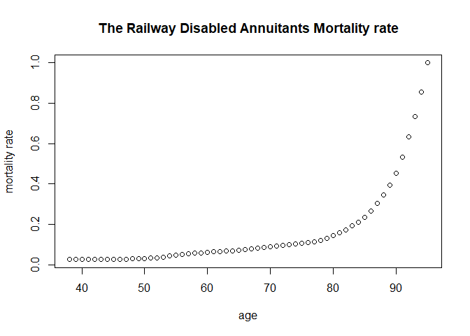

<!-- README.md is generated from README.Rmd. Please edit that file -->

# SOAmort

<!-- badges: start -->
<!-- badges: end -->

The `SOAmort` is a `R` package that makes web crawling of a website call
SOA mort. It has functions to obtain the mortality table data hosted on
the website [mort.soa.org](https://mort.soa.org/).

## Install package

``` r
devtools::install_github("issactoast/SOAmort")
```

## Load package

``` r
library(SOAmort)
```

The package consists of three functions:

-   makeSearchInfo
-   getTableInfo
-   getTable

The mort.soa page provide the search options for the various tables
using search parameters such as `Usage`, `Nation`, `Table layout` etc.
The first two function will used for accessing the search result of the
website.

### Search table using makeSearchInfo and getTableInfo

We will make a body to make a search request parameter which can be fed
to the `getTableInfo` function. For example, if we want to search the
table for USA’s Annuitant Mortality select table, the search parameter
will be the following:

``` r
myrequest <- makeSearchInfo(
    tableUsage = "Annuitant Mortality",
    nation = "United States of America",
    tableType = "Select")
```

After make the request parameter, we can feed this to the function
`getTableInfo` as follows:

``` r
result <- getTableInfo(myrequest)
```

result variable is a list which contains the infomation of the search
result from the website.

``` r
# Table numbers which satisfies to the request
result$TableIdentity
#> [1]  856  857  858  859  950 1600 1601

# Table Name/ Description
result$TableName
#> [1] "Table 4: 1944 RRB Railway Disabled Annuitants Mortality Table, ALB"
#> [2] "Table S-2: 1956 RRB Railway Disabled Annuitants Mortality, ANB"    
#> [3] "Table S-2: 1965 RRB Railway Disabled Annuitants Mortality, ANB"    
#> [4] "Table S-3: 1965 RRB Railway Totally Disabled Annuitants, ANB"      
#> [5] "Table S-6: 1956 RRB Railway Remarriage Table - Female, ANB"        
#> [6] "American Annuitants Table <U+2013> Male, ANB"                      
#> [7] "American Annuitants Table <U+2013> Female, ANB"

# Table Usage
result$ContentType
#> [1] "Annuitant Mortality" "Annuitant Mortality" "Annuitant Mortality"
#> [4] "Annuitant Mortality" "Annuitant Mortality" "Annuitant Mortality"
#> [7] "Annuitant Mortality"
```

We can see there are 7 tables in the result.

### Access to the tables using table number

The `getTable` function allows you to access the actual table using the
table number. For example, you can obtain the fist table 856 in the
result variable as follows:

``` r
result <- SOAmort::getTable(856)
#> No encoding supplied: defaulting to UTF-8.
#> [1] "Accessing to mort.soa.org"
#> No encoding supplied: defaulting to UTF-8.
#> [1] "Accessing to mort.soa.org"
#> No encoding supplied: defaulting to UTF-8.
#> [1] "Accessing to mort.soa.org"
#> [1] "Accessing to mort.soa.org"
#> [1] "Success"
```

The package is using `httr` package to crawling, it will keep trying to
catch the table utill it reach the maximum try or success to grab the
table information.

``` r
length(result)
#> [1] 2
```

Result shows that there are two table in the 856 table. To see the
information about the table you can use `attributes` function.

``` r
names(attributes(result[[1]]))
#>  [1] "names"             "class"             "row.names"        
#>  [4] "Table Identity"    "Provider Domain"   "Provider Name"    
#>  [7] "Table Reference"   "Content Type"      "Table Name"       
#> [10] "Table Description" "Comments"          "Nation"           
#> [13] "Scaling Factor"    "Data Type"
```

To see the difference between the two table, let us check the table
description.

``` r
attributes(result[[1]])$`Table Description`
#> [1] "Table 4: 1944 Railroad Retirement Board (RRB) Railway Disabled Annuitants Mortality Table.  Select Period Minimum Age: 30 Select Period Maximum Age: 64."
attributes(result[[2]])$`Table Description`
#> [1] "Table 4: 1944 Railroad Retirement Board (RRB) Railway Disabled Annuitants Mortality Table.  Ultimate Minimum Age: 38. Ultimate Maximum Age: 95"
```

It says the second table is the Railway Disabled Annuitants Mortality
Ultimate Table whose minimum age 38 and the maximum age 95.

``` r
RRBultmort <- result[[2]]
dim(RRBultmort)
#> [1] 58  2
min(RRBultmort$age)
#> [1] 38
max(RRBultmort$age)
#> [1] 95
head(RRBultmort)
#>   age Column 1
#> 1  38    0.026
#> 2  39    0.026
#> 3  40    0.026
#> 4  41    0.026
#> 5  42    0.026
#> 6  43    0.027
```

``` r
plot(RRBultmort$age, RRBultmort$`Column 1`,
     main = "The Railway Disabled Annuitants Mortality rate",
     xlab = "age",
     ylab = "mortality rate")
```



## Give me your feedback

If you are having any issue and have an idea about the package, please
make an issue in the [github
repo](https://github.com/issactoast/SOAmort/issues).
